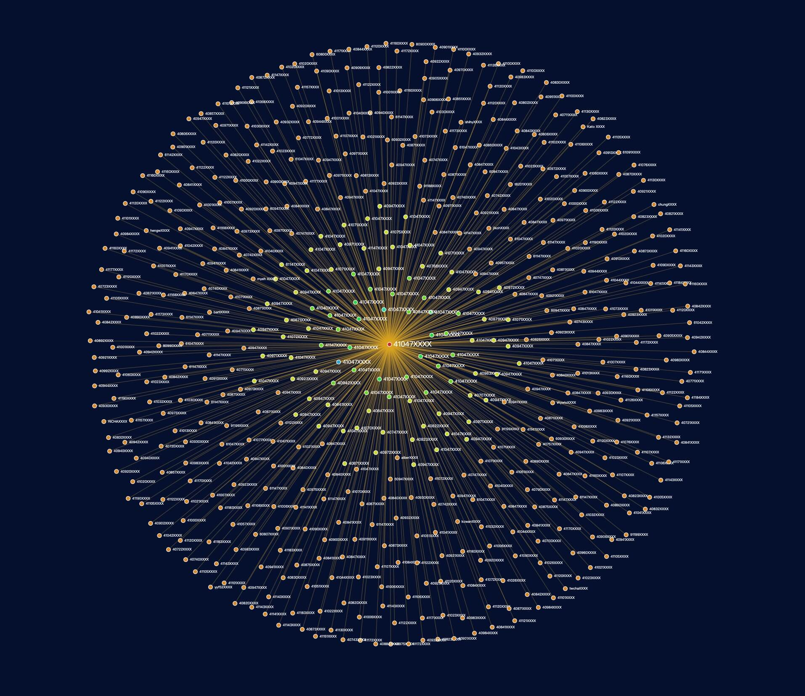
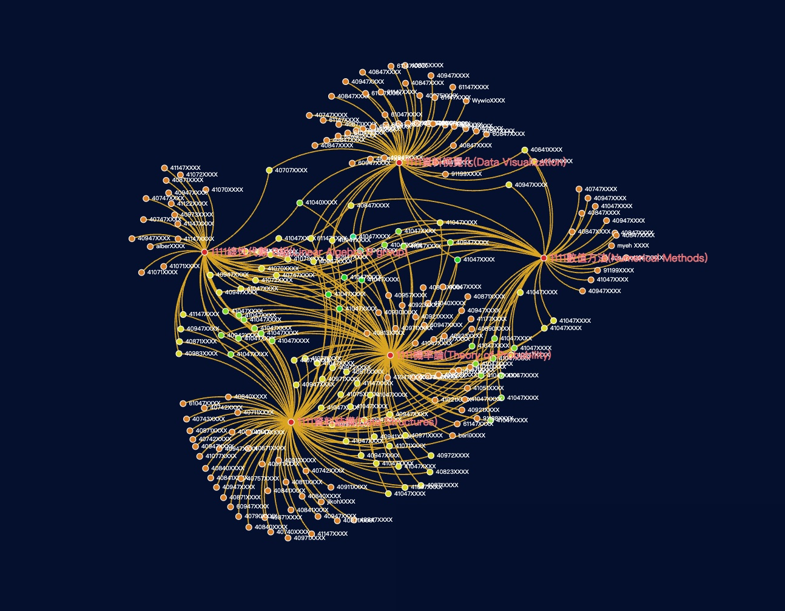

# Moodle User Intersection

## 使用方法

前往 <https://jacoblincool.github.io/moodle-user-intersection/>。

1. 輸入 Moodle Session 抓取課程名單
2. 選擇要分析的課程
3. 看看誰跟你修了最多相同的課程！

> 注意！本工具**不會**儲存你的 Session，只會用作一次性的名單抓取用途。
> 但會儲存去識別化的名單，作為快取用途來加速服務，同時也避免造成 Moodle 負擔。

> Moodle Session 在哪裡？ Moodle Session 存在 Moodle 網站的 Cookie 中，為 26 字元字串。

https://user-images.githubusercontent.com/28478594/193317553-186fcef8-2e85-4b03-9bd8-98a3af58b865.mp4
